# CKV Internet Banking System

CKV Internet Banking System is a web-based banking platform developed as part of a Rapid Application Development (RAD) group project.

The system allows bank customers to register for online banking, securely log in, and perform common banking operations such as viewing account information and managing transactions.

---

## Project Overview
The purpose of this project is to simulate a simplified **online banking system** that demonstrates how financial institutions can provide secure digital banking services to their customers.

The system focuses on implementing core banking features along with basic security mechanisms for authentication and account protection.

---

## Live Demo
The system is publicly accessible at:

http://ckvsystem.runasp.net/

Test Accounts

Customer  
Username: UserNumber1  
Password: User@123  

Admin  
Username: Admin321  
Password: Admin@123

---

## System Preview
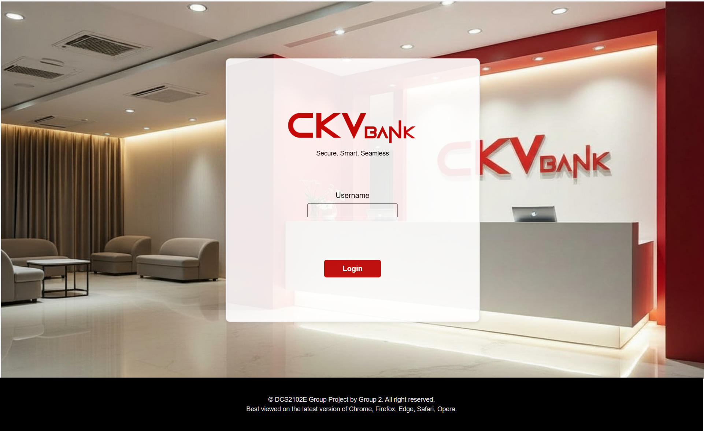
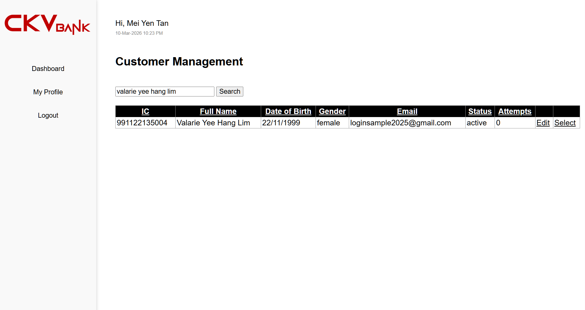
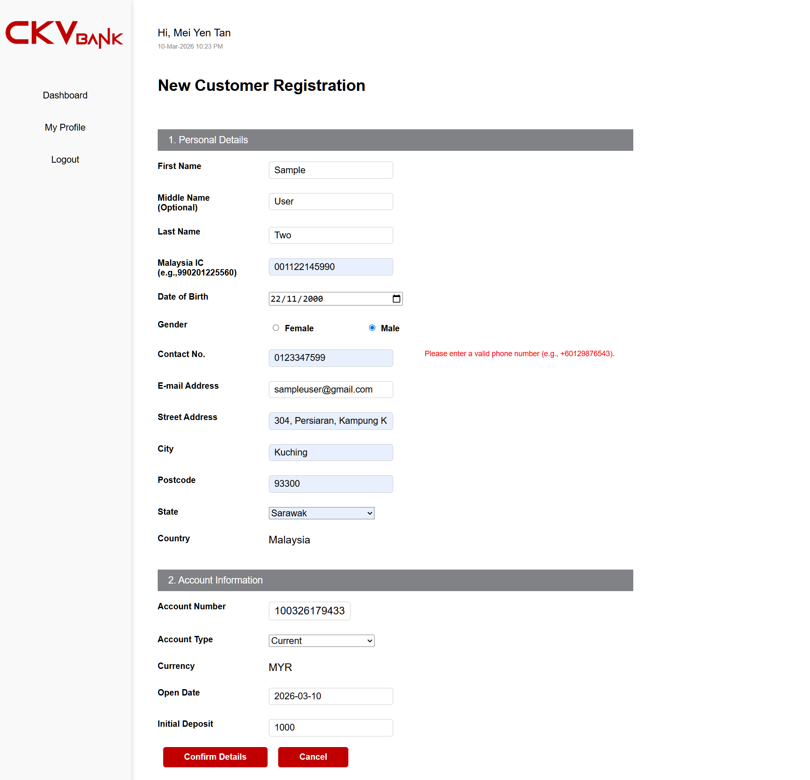
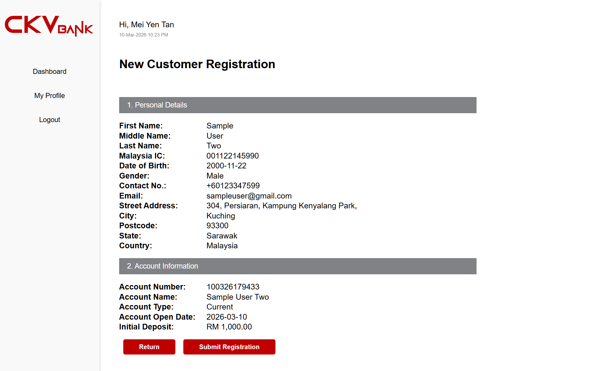
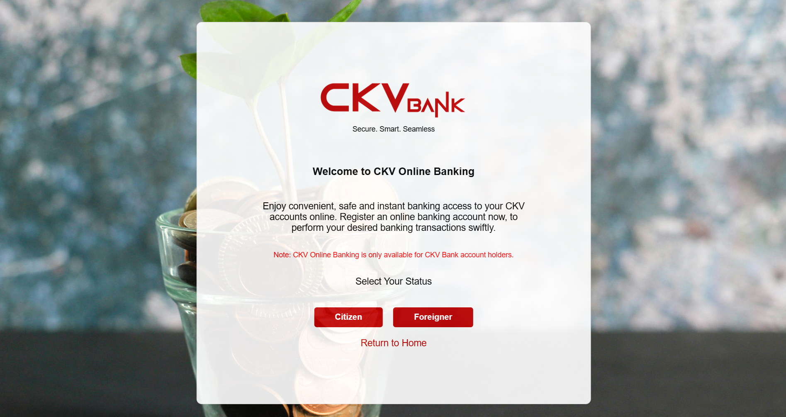
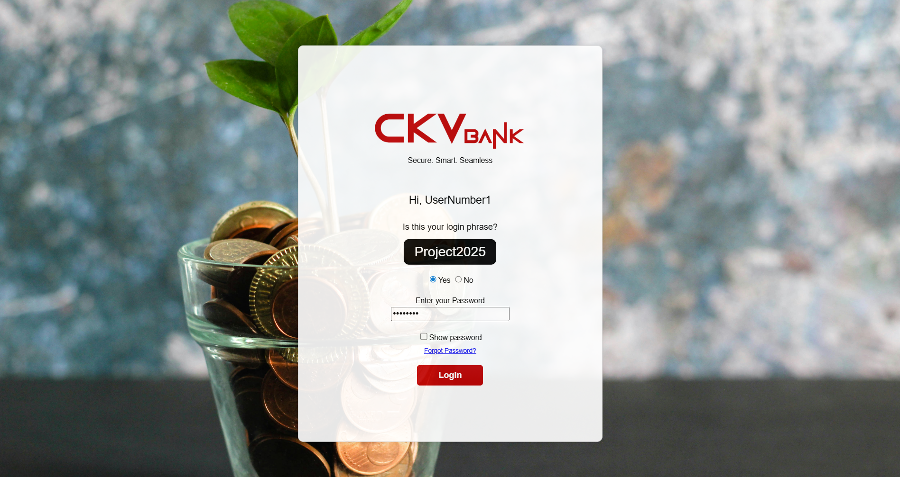
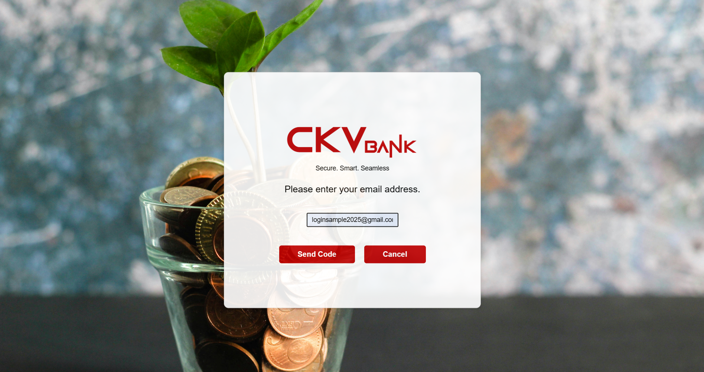
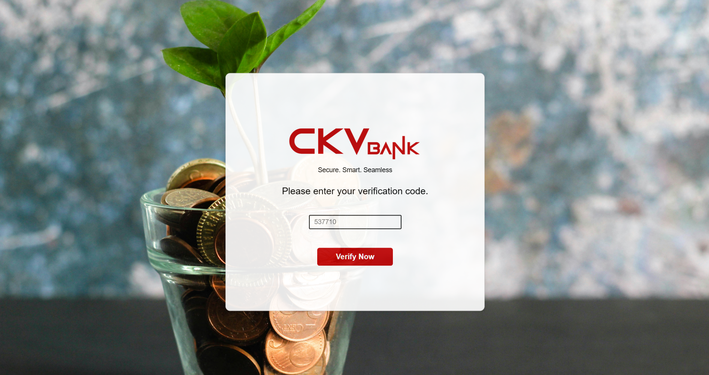
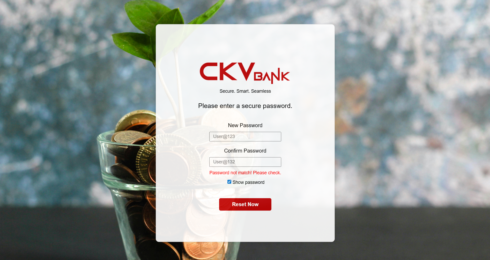
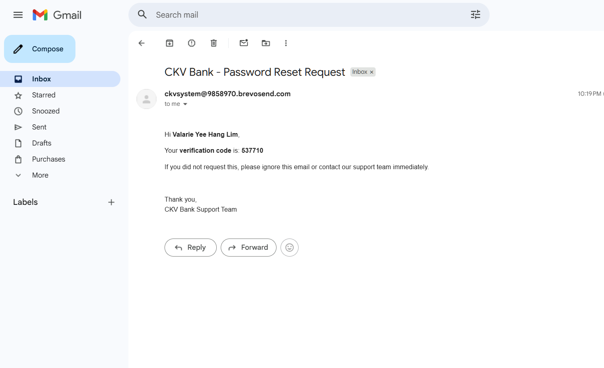
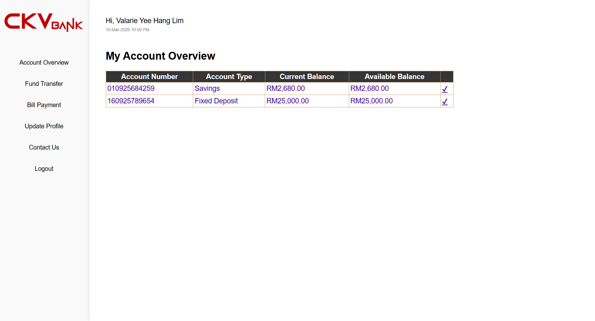
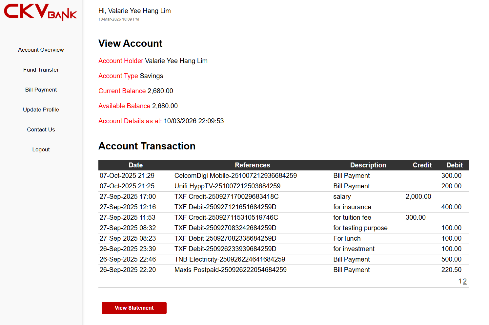
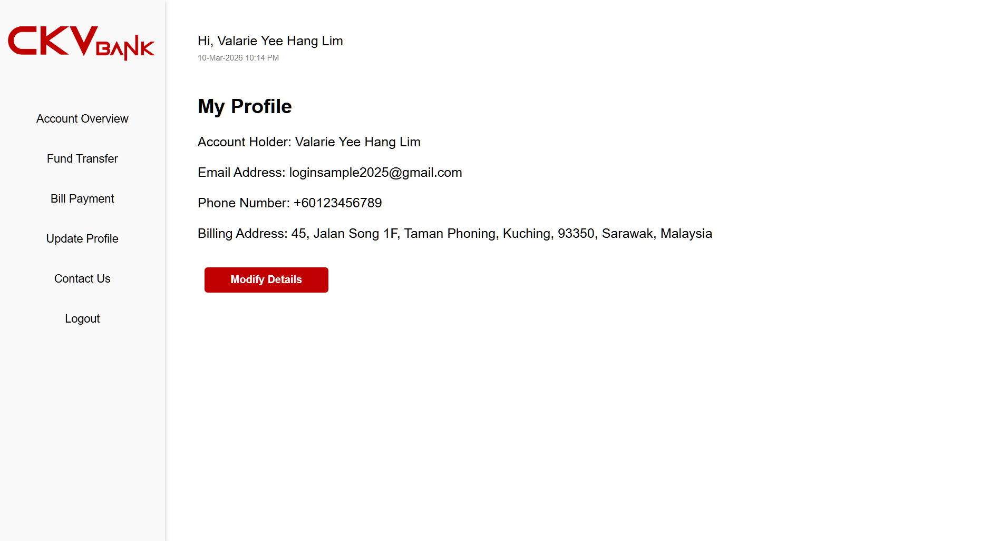
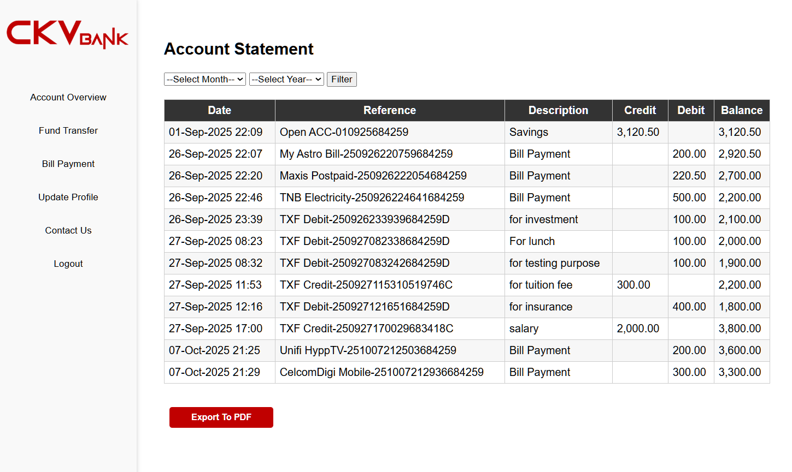

---

## My Role
This was a **group project**, and I served as the **group leader**.

My responsibilities included coordinating the development process, managing task distribution among team members, and ensuring overall project progress.

### My Contributions
- Designed the **overall user interface layout** of the banking system
- Created customized background visuals incorporating the **CKV Bank logo**
- Used **AI image generation tools** to produce customized background assets for the system interface
- Implemented the **customer registration system**
- Developed the **login authentication system**
- Implemented **password hashing using SHA-256**
- Implemented **account lockout after multiple failed login attempts**
- Learned to use **GitHub for version control and collaboration**
- Set up the project repository and **taught team members how to use GitHub for collaborative development**
- Contributed to database integration and system testing

---

## Additional Development After Project Submission
After the project submission, some modules assigned to team members — including **transaction handling, record viewing, and report printing** — were not fully completed.

To ensure the system was functional and complete, I independently learned the required implementation and **completed these modules myself after the project submission**.

This allowed the system to function as a more complete banking application.

---

## System Features
- Customer registration for online banking
- Secure login authentication system
- Password hashing using SHA-256
- Account lockout after multiple failed login attempts
- Customer account information management
- Transaction handling module
- Record viewing system
- Printable banking records
- Database-driven system

---

## Security Features
The system includes several security mechanisms to protect user accounts:
- Password hashing using **SHA-256**
- Login attempt limit to prevent brute-force attacks
- Secure authentication logic

These features demonstrate basic security practices used in online banking systems.

---

## User Interface Design
The interface layout was designed to resemble a simple banking system interface.

Customized background visuals were created using **AI-generated images** and integrated with the **CKV Bank logo** to provide a consistent visual identity for the system.

---

## Version Control & Collaboration
The project used **GitHub** for version control and team collaboration.

I learned how to use GitHub during the project and introduced it to the team, guiding team members on how to use GitHub to manage and collaborate on the project code.

---

## System Modules
The system consists of several functional modules:
- Customer registration module
- Authentication module
- Customer account management
- Transaction management
- Record viewing and printing
- Administrative functions

---

## Technologies Used
- ASP.NET Web Forms
- VB.NET
- SQL Server
- HTML
- CSS
- JavaScript
- GitHub (version control and collaboration)
- AI image generation tools (UI background assets)

---

## Cloud Deployment
The system was initially deployed to **Microsoft Azure** during the project submission phase to demonstrate cloud hosting of an ASP.NET web application with SQL Server database integration.

After the project submission, additional system modules were independently completed and the system was redeployed to **MonsterASP.NET hosting** to provide a stable public live demo.

This deployment allows users to experience the full functionality of the CKV Internet Banking System online.

---

## System Architecture
The system follows a typical **three-tier web application structure**.

### Frontend
- HTML
- CSS
- JavaScript

### Backend
- ASP.NET Web Forms
- VB.NET

### Database
- SQL Server

---

## Development Methodology
This project was developed using the **Rapid Application Development (RAD)** methodology.

RAD emphasizes rapid prototyping, iterative development, and quick feedback cycles during the development process.

---

## What I Learned
Through this project, I gained experience in:
- Implementing secure authentication systems
- Applying password hashing techniques
- Integrating web applications with databases
- Designing basic banking system workflows
- Using GitHub for collaborative development
- Leading and coordinating development in a team project
- Independently learning and completing unfinished system modules

---

## Author
Valarie Lim  
Diploma in Information Technology
